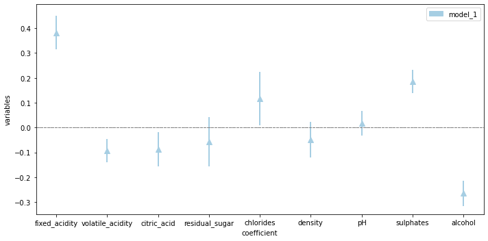
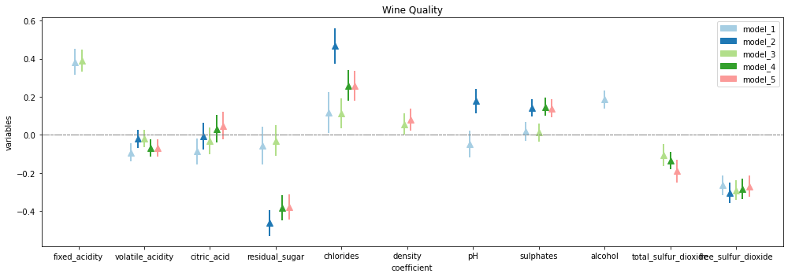
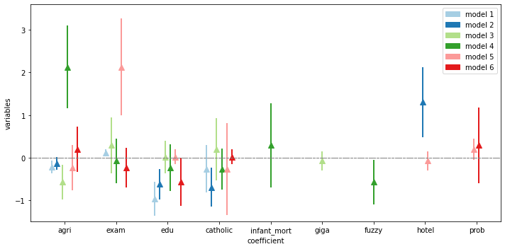
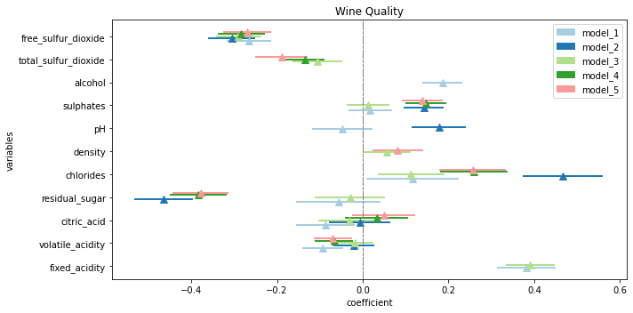
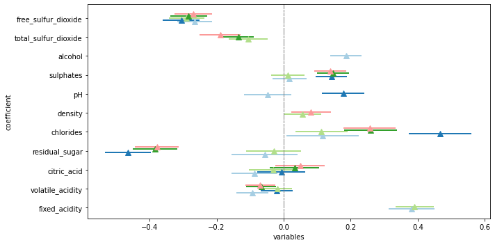
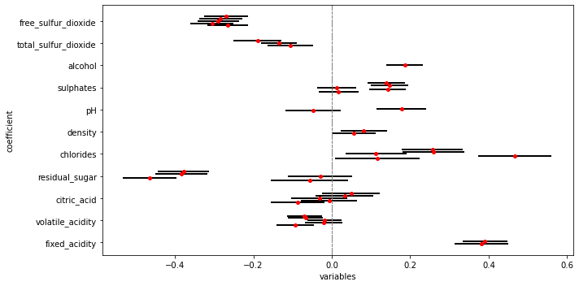
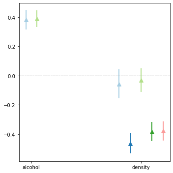

## Basic usage -- Example

first, install the main package


```python
#!pip install gascoigne
```

after having installed the package import the necessary module


```python
from gascoigne import regplot
```

the input data of the function can be of two types:
- a statmodels output
- a pandas dataframe (with a pre-defined shape)

### example using statmodels


```python
import numpy as np
import pandas as pd
import statsmodels.api as sm
import statsmodels.formula.api as smf
from sklearn.preprocessing import StandardScaler
```

load data


```python
df=pd.read_csv("D:\\Download_new\\winequality-red.csv")
## adjust names
colnames=col_names=["_".join(x.split()) for x in df.columns]
## standardize mean and variance
df=pd.DataFrame(StandardScaler().fit_transform(df))
df.columns=colnames
df.head()
```


<div>
<style scoped>
    .dataframe tbody tr th:only-of-type {
        vertical-align: middle;
    }

    .dataframe tbody tr th {
        vertical-align: top;
    }

    .dataframe thead th {
        text-align: right;
    }
</style>
<table border="1" class="dataframe">
  <thead>
    <tr style="text-align: right;">
      <th></th>
      <th>fixed_acidity</th>
      <th>volatile_acidity</th>
      <th>citric_acid</th>
      <th>residual_sugar</th>
      <th>chlorides</th>
      <th>free_sulfur_dioxide</th>
      <th>total_sulfur_dioxide</th>
      <th>density</th>
      <th>pH</th>
      <th>sulphates</th>
      <th>alcohol</th>
      <th>quality</th>
    </tr>
  </thead>
  <tbody>
    <tr>
      <th>0</th>
      <td>-0.528360</td>
      <td>0.961877</td>
      <td>-1.391472</td>
      <td>-0.453218</td>
      <td>-0.243707</td>
      <td>-0.466193</td>
      <td>-0.379133</td>
      <td>0.558274</td>
      <td>1.288643</td>
      <td>-0.579207</td>
      <td>-0.960246</td>
      <td>-0.787823</td>
    </tr>
    <tr>
      <th>1</th>
      <td>-0.298547</td>
      <td>1.967442</td>
      <td>-1.391472</td>
      <td>0.043416</td>
      <td>0.223875</td>
      <td>0.872638</td>
      <td>0.624363</td>
      <td>0.028261</td>
      <td>-0.719933</td>
      <td>0.128950</td>
      <td>-0.584777</td>
      <td>-0.787823</td>
    </tr>
    <tr>
      <th>2</th>
      <td>-0.298547</td>
      <td>1.297065</td>
      <td>-1.186070</td>
      <td>-0.169427</td>
      <td>0.096353</td>
      <td>-0.083669</td>
      <td>0.229047</td>
      <td>0.134264</td>
      <td>-0.331177</td>
      <td>-0.048089</td>
      <td>-0.584777</td>
      <td>-0.787823</td>
    </tr>
    <tr>
      <th>3</th>
      <td>1.654856</td>
      <td>-1.384443</td>
      <td>1.484154</td>
      <td>-0.453218</td>
      <td>-0.264960</td>
      <td>0.107592</td>
      <td>0.411500</td>
      <td>0.664277</td>
      <td>-0.979104</td>
      <td>-0.461180</td>
      <td>-0.584777</td>
      <td>0.450848</td>
    </tr>
    <tr>
      <th>4</th>
      <td>-0.528360</td>
      <td>0.961877</td>
      <td>-1.391472</td>
      <td>-0.453218</td>
      <td>-0.243707</td>
      <td>-0.466193</td>
      <td>-0.379133</td>
      <td>0.558274</td>
      <td>1.288643</td>
      <td>-0.579207</td>
      <td>-0.960246</td>
      <td>-0.787823</td>
    </tr>
  </tbody>
</table>
</div>


run a bunch of random regression models


```python
model_1=smf.ols('quality ~ fixed_acidity + volatile_acidity +citric_acid+ residual_sugar+chlorides+density+density+pH+sulphates+alcohol ', data=df).fit()
model_2=smf.ols('quality ~ fixed_acidity + volatile_acidity +citric_acid+ residual_sugar+chlorides+density+density+pH ', data=df).fit()
model_3=smf.ols('quality ~ fixed_acidity + volatile_acidity +citric_acid+ residual_sugar+chlorides+density+total_sulfur_dioxide+alcohol+free_sulfur_dioxide ', data=df).fit()
model_4=smf.ols('quality ~ fixed_acidity + volatile_acidity +citric_acid+ residual_sugar+chlorides+density+total_sulfur_dioxide+density ', data=df).fit()
model_5=smf.ols('quality ~ fixed_acidity + volatile_acidity +citric_acid+ residual_sugar+chlorides+density+total_sulfur_dioxide+free_sulfur_dioxide ', data=df).fit()
```

## plot with statmodels output

## single model


```python
regplot.coeff_plot(model_1)
```





## multiple models

just pass a list of the model


```python
regplot.coeff_plot([model_1,model_2,model_3,model_4,model_5],figsize=(14,5),axis_title="Wine Quality")
```





## PLOT WITHOUTH STATMODELS


```python
df2=pd.read_excel("D:\\Download_new\\coef_model_multiple.xlsx")
```

make sure your result file have the following format and column names!


```python
df2.head()
```


<div>
<style scoped>
    .dataframe tbody tr th:only-of-type {
        vertical-align: middle;
    }

    .dataframe tbody tr th {
        vertical-align: top;
    }

    .dataframe thead th {
        text-align: right;
    }
</style>
<table border="1" class="dataframe">
  <thead>
    <tr style="text-align: right;">
      <th></th>
      <th>coef</th>
      <th>err</th>
      <th>model</th>
      <th>varname</th>
    </tr>
  </thead>
  <tbody>
    <tr>
      <th>0</th>
      <td>-0.220646</td>
      <td>0.148531</td>
      <td>model 1</td>
      <td>agri</td>
    </tr>
    <tr>
      <th>1</th>
      <td>-0.260582</td>
      <td>0.553176</td>
      <td>model 1</td>
      <td>exam</td>
    </tr>
    <tr>
      <th>2</th>
      <td>-0.961612</td>
      <td>0.392609</td>
      <td>model 1</td>
      <td>edu</td>
    </tr>
    <tr>
      <th>3</th>
      <td>0.124418</td>
      <td>0.075207</td>
      <td>model 1</td>
      <td>catholic</td>
    </tr>
    <tr>
      <th>4</th>
      <td>-0.129292</td>
      <td>0.151049</td>
      <td>model 2</td>
      <td>agri</td>
    </tr>
  </tbody>
</table>
</div>


simply pass the dataframe


```python
regplot.coeff_plot(df2,smf=False)
```





# orientation


```python
regplot.coeff_plot([model_1,model_2,model_3,model_4,model_5],orientation="vertical",axis_title="Wine Quality",xlabel="coefficient",ylabel="variables")
```





## drop legend


```python
regplot.coeff_plot([model_1,model_2,model_3,model_4,model_5],orientation="vertical",legend=False)
```





## change colors and markers


```python
regplot.coeff_plot([model_1,model_2,model_3,model_4,model_5],marker=".",orientation="vertical",bar_colors="black",marker_colors="red",legend=False)
```





## select only some variables and change figure size


```python
regplot.coeff_plot([model_1,model_2,model_3,model_4,model_5],selected_var=["alcohol","density"],figsize=(5,5),legend=False,xlabel="",ylabel="")
```




