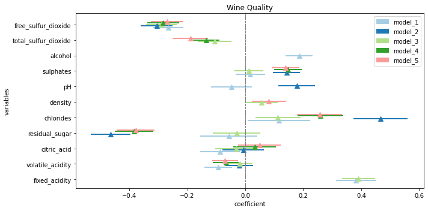

# The Gascoigne package
a miscellaneous package of functions for python visualization.

## how to use the regression coefficient plot function: 

## installation
pip install gascoigne

## usage
from gascoigne import regplot
regplot.coeff_plot(a model or a list of model)

for a list of examples  [see the notebook example here](https://github.com/gabrielepinto/gascoigne/blob/main/EXAMPLE_regplot.md)

For help and feedback please [open a github issue](https://github.com/gabrielepinto/gascoigne/issues).